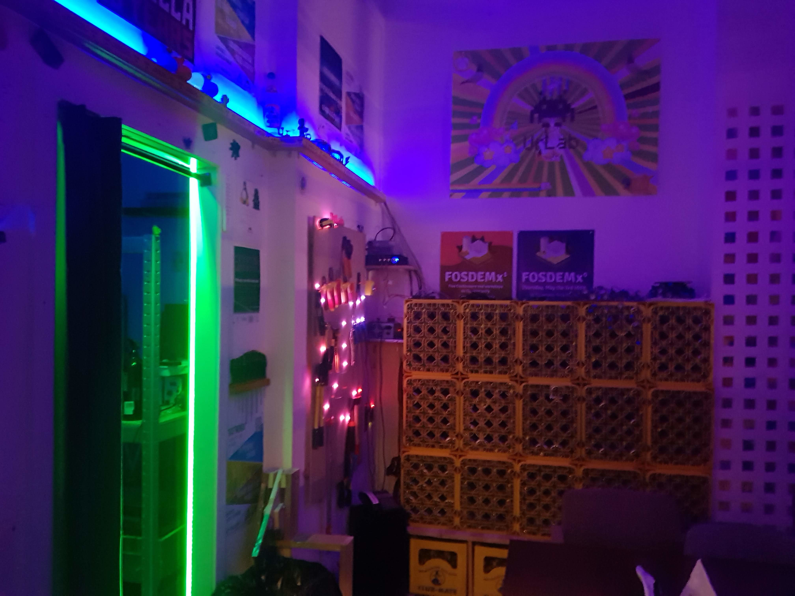

# HAL1
HAL1 est le nouveau bot d'UrLab pour remplacer feu Hal.

Il est basé sur un système distribué de senseurs (température, levier, ...) et animations (leds, buzzers, relays, ...) et utilise `MQTT` comme systeme de communication.
Le but étant de rajouter plein de wemos mini (`ESP8266`) pour chaque feature que l'on souhaite implémenter

# Hiérarchie
Le repo est organisé comme suit:
 * script : dossier contenant les scripts (essentiellement en python) a faire tourner sur un serveur
 * wemos: dossier contenant le code source (et les projets platformIO) des différents wemos présent à UrLab
 * website : pour les différents sites web qui permettent d'intéragir avec Hal1
 * templates : qui abritera les templates de code génériques
 * topics : qui abritera une documentation plus ou moins à jour sur les topics MQTT utilisés

# Ajouter un nouvel ESP?

Nous utilisons [PlatformIO](https://platformio.org/) pour compiler et pusher le code sur les wemos.
Il est disponible en terminal ou sur [Atom](https://docs.platformio.org/en/latest/ide/atom.html).

Chaque projet PlatformIO pour chaque ESP se trouve dans son dossier respectif dans le dossier `wemos` (MarieGuiGui, Opinator...).

# Code of conduct :
* mettez un README dans chacun des projets pour expliquer ce qu'il fait (bonus pour les images et la doc électronique)
* utilisez les templates se trouvant dans le dossier template pour les wemos. ça nous permetra de les upgrader en wifi
* évitez de laisser des mots de passe dans les codes (le code sera compilé avec wifiConfig.h dans le repo)

# Documentation :
Nous avons de la documentation un peu plus détaillée sur le [wiki](https://urlab.be/r/hal1) d'UrLab
