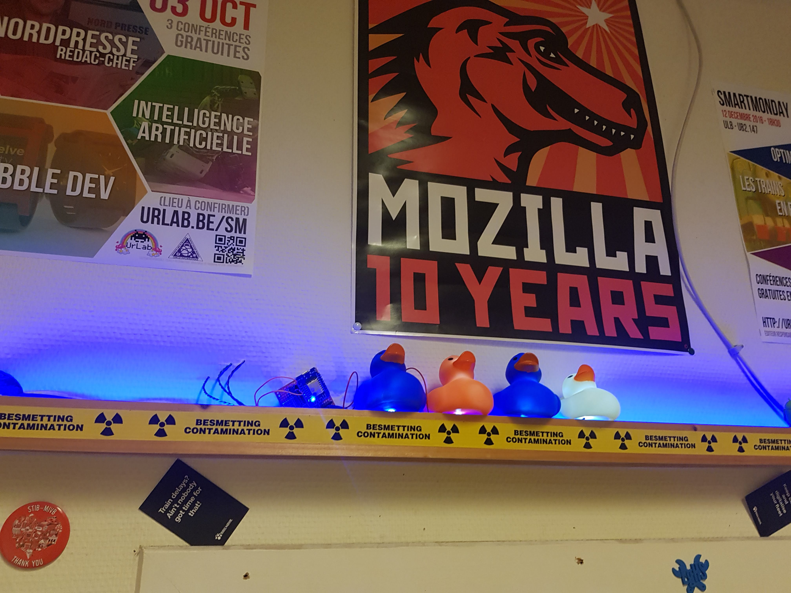
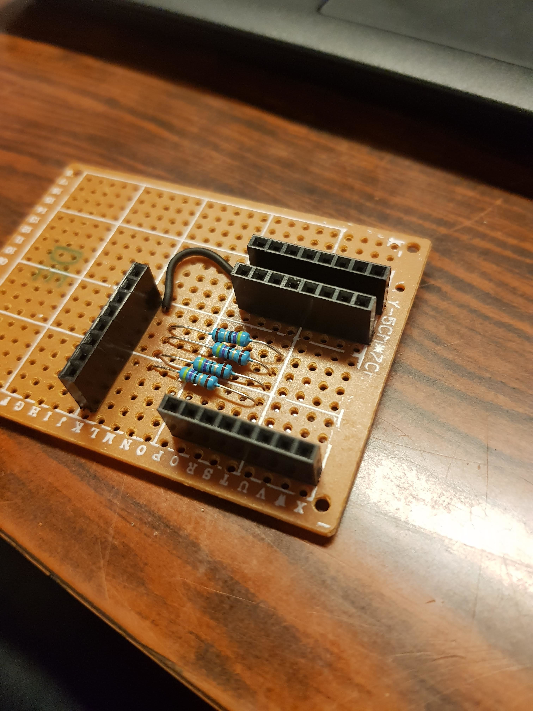
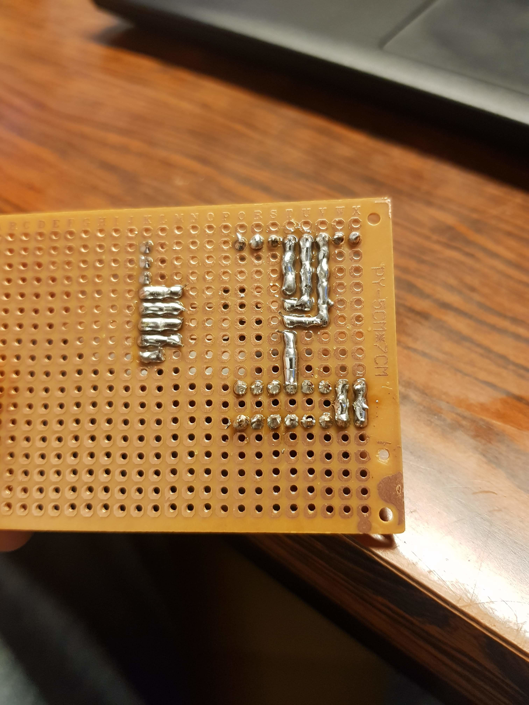

# Duck Ass
Ceci est l'ESP qui allimente les LED qui se trouvent dans le cul des cannards au dessus de la porte entre les deux pieces.

# Libs a installer :
* PubSubClient

# Électronique :
* 4 résistances de 48 ohm
* 4 LED blanches allimentées en 3.3V
* un wemos mini ESP8266

